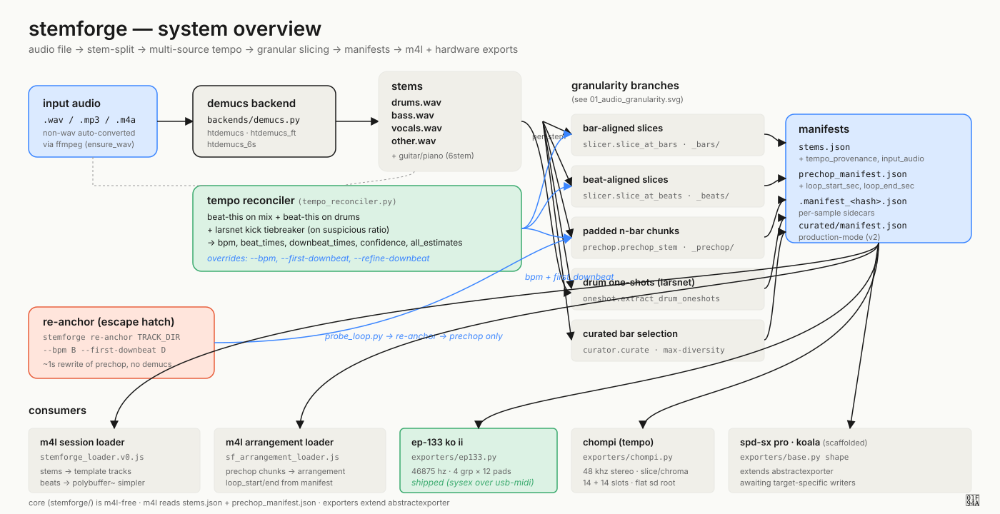

# 00 — system overview

stemforge takes one audio file (full mix) and turns it into a tree of pre-cut,
manifest-tagged audio assets ready for ableton, the ep-133, and any other
hardware sampler we add a writer for. the pipeline is intentionally split into
two zones: a pure-python core (`stemforge/`) that does separation, tempo
detection, slicing, curation, and export; and a max-for-live layer (`v0/src/m4l-js/`)
that reads the core's manifests and drops clips into a live set. core has zero
m4l imports — m4l reads `stems.json` and `prechop_manifest.json` over the
filesystem and never crosses back into python.

the spine is `stemforge split` (or `forge`): convert non-wav to wav, run demucs,
then hand the mix and the drums stem to the multi-source tempo reconciler. the
reconciler runs beat-this on both, watches for half-time / double-time / triplet
disagreements via a "suspicious ratios" check, and only burns the ~10s on a
larsnet kick tiebreaker when the two detectors disagree by a clean round
factor. its output (bpm, beat times, downbeat times, confidence, full
provenance trail) is what every downstream slicer keys off — so getting the
grid right early is the single highest-leverage operation in the pipeline.
when auto-detection isn't trusted, `--bpm` and `--first-downbeat` overrides
short-circuit it; either way the manifest records both what the detector said
and what the user used so the disagreement becomes a labeled example for
future detector work.

with the grid locked, stems fan out into five parallel branches — bar slicer,
beat slicer, prechop chunker, larsnet drum-oneshot extractor, and curator —
each producing a different audio granularity for a different downstream use.
those branches are the subject of `01_audio_granularity.svg`. their outputs
are described by manifests: `stems.json` (top-level pipeline manifest),
`prechop_manifest.json` (n-bar chunk index with per-chunk loop regions),
per-sample `.manifest_<hash>.json` sidecars (hardware-loader-friendly
metadata), and `curated/manifest.json` (production-mode v2 schema).

the **re-anchor** escape hatch in the lower left is worth flagging. when
auto-detection misses (most often on half-time hip-hop) the user can iterate
bpm + first-downbeat values in `tools/probe_loop.py`, then call
`stemforge re-anchor` to rewrite only the prechop chunks at the correct grid
without re-running demucs — turning a ~30s reforge into a sub-second fix.
the manifest's `tempo_provenance.warning` keeps the audit trail of what was
overridden and why.

consumers downstream of the manifests: the m4l session loader drops stems
into template tracks and per-beat slices into a `polybuffer~`-backed simpler;
the m4l arrangement loader places prechop chunks end-to-end on the timeline
with each clip's loop region pre-set from `loop_start_sec`/`loop_end_sec`;
the ep-133 exporter (shipped, sysex over usb-midi) writes 46875 hz mono into
4 groups × 12 pads with mute-group + playmode metadata; chompi, spd-sx pro,
and koala exporters share the same `AbstractExporter` base shape but the
device-specific writers are still in scaffold state.
