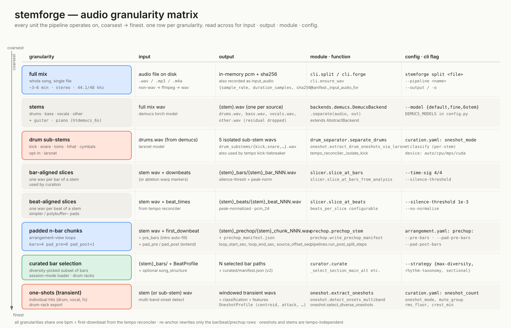

# 01 — audio granularity matrix

stemforge is a granularity factory. starting from one full-mix audio file we
end up with up to eight different cuts of the same audio — each at a
different time scale, each fed downstream to a different consumer. that
sounds redundant until you actually try to use one cut everywhere: an
arrangement-view loop is too long for a drum-rack pad; a transient one-shot
is the wrong shape for a song-form clip slot; a single beat is too short to
ableton-warp without artifacts. so we cut the audio at every scale we know
we'll consume it at, and let the manifest layer keep track of what came from
where.

## why so many granularities

the rows fall into three groups. **stems** (full mix → demucs stems → larsnet
sub-stems) are the source-separation tree — these don't change with tempo and
get reused across every downstream slicer. **musical-grid units** (bar
slices, beat slices, padded n-bar chunks, curated selections) all share one
bpm + first-downbeat coming out of the tempo reconciler — they're the rows
that depend on the grid being right, and they're exactly the rows
`stemforge re-anchor` rewrites in place. **transient-grid units** (one-shots)
key off onset detection inside a stem and don't care about the song-level
grid at all.

## how to pick the right granularity for a use case

| use case | granularity | why |
|---|---|---|
| drag a song into ableton arrangement view as 4-bar loops | padded n-bar chunks | each chunk wav already encodes its loop region; the m4l arrangement loader sets `clip.loop_start`/`loop_end` from `loop_start_sec`/`loop_end_sec` directly; default `pad_pre_bars=0` puts bar 1 at frame 0 of the wav so live's auto-warp can't snap into leading air |
| simpler / polybuffer-backed pad bank for live performance | beat-aligned slices | every beat is its own pcm-24 file with peak-normalized levels across stems; loads straight into a `polybuffer~` and indexes by beat number |
| ep-133 pad bank from a song's drum loops | bar-aligned slices → curator → ep-133 exporter | curator picks n bars by max-diversity (or rhythm-taxonomy / sectional); exporter resamples to 46875 hz mono and writes per-pad sysex |
| drum rack of kicks/snares/hats from a single song | drum sub-stems → one-shots | larsnet isolates the kick before onset detection so each pad gets a clean, classifiable hit; `OneshotProfile` carries spectral features so the diverse-pick variant doesn't ship eight near-identical kicks |
| song-form (intro/verse/chorus) clip slots | bar slices + curator with `--strategy section-main-alt` | needs a `SongStructure` from `segmenter.py`; picks one MAIN bar plus N ALTs per detected section so the user gets backbone + variations |
| just stems, no slicing | full stems (`--no-slice`) | when you want demucs output and nothing else; manifest still records tempo provenance for downstream tools |

## invariants

- **one grid for everything.** all musical-grid rows derive from the same
  `bpm` + `beat_times` + `downbeat_times` triple coming out of the tempo
  reconciler. an override (`--bpm`, `--first-downbeat`, or `re-anchor`)
  rebuilds them all consistently.
- **tempo-independent rows are cheap to reuse.** demucs stems, larsnet
  sub-stems, and one-shots don't depend on the grid. `re-anchor` doesn't
  touch them — it only rewrites the bar/beat/prechop dirs.
- **manifests track everything.** `stems.json` records the top-level
  pipeline state including `tempo_provenance` (every estimate that ran,
  not just the winner) and `input_audio` (sha256 + sample-rate + duration,
  so a silent resample under us is detectable). `prechop_manifest.json`
  records each chunk's `loop_start_sec`/`loop_end_sec` offsets within the
  padded wav. per-sample `.manifest_<hash>.json` sidecars carry pad / bpm
  / playmode / mute-group hints for hardware loaders.
- **`pad_pre_bars=0` is load-bearing.** when prechop chunks have any
  pre-pad, ableton's auto-warp can snap `start_marker` past the first
  transient and the loop sounds late by a beat. with `pad_pre_bars=0`,
  wav frame 0 *is* bar 1 and there's nothing for auto-warp to swallow.
  the `pad_post_bars=1` default still gives the user drag-extend headroom
  forward.

cross-references: `stemforge/cli.py` (split / forge / re-anchor),
`stemforge/tempo_reconciler.py` (the grid),
`stemforge/prechop.py` (n-bar chunks + loop regions),
`stemforge/slicer.py` (bar + beat slicers),
`stemforge/oneshot.py` (transient extractor + larsnet path),
`stemforge/curator.py` (diversity selection),
`stemforge/manifest.py` + `stemforge/manifest_schema.py` (the manifest layer).
