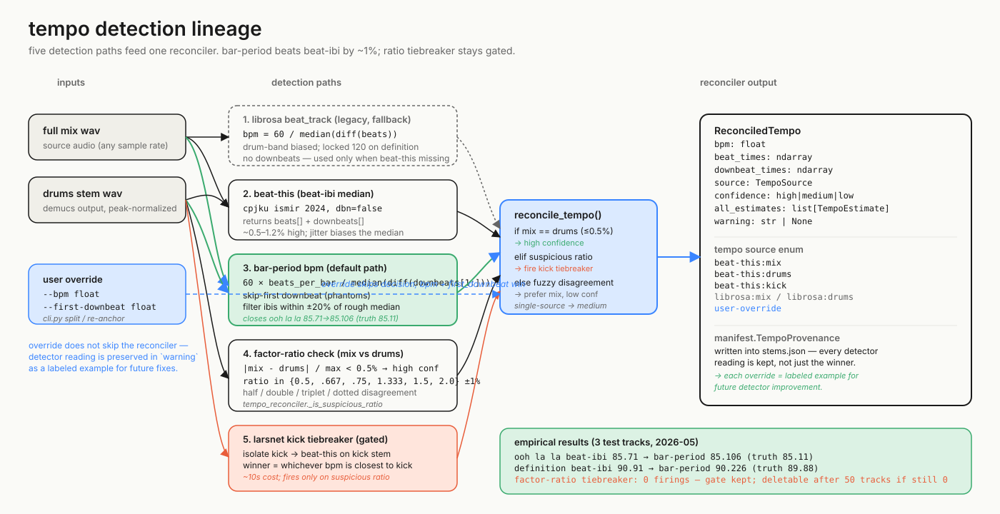

# tempo detection lineage

## why we have five detectors instead of one

A "BPM detector" sounds like a single algorithm, but in practice every
detector is a bet about which rhythmic layer in the audio is the *bar*. Get
that wrong and the rest of the pipeline cuts at the wrong grid: prechop
chunks span four grid-bars but only three musical-bars of audio, every
clip seam clicks, and the M4L device looks broken even though Demucs
worked perfectly. Black Star — *Definition* (true ~90 BPM, kick on 1+3,
strong half-bar pulse) was the canonical failure: librosa's `beat_track`
locked onto the half-bar pulse and reported ~120, and so did older
beat-this builds. The reconciler exists because no single detector is
right on every track, and we need cheap evidence to decide which one to
trust on a given input.

## what each path is good and bad at

The legacy `librosa.beat.beat_track` path is kept only as a fallback when
beat-this isn't installed; it has no downbeats and the manifest tags its
output `librosa:*` so downstream consumers know to distrust it. The
beat-this beat-IBI median is the obvious second tier — neural,
returns downbeats — but its median runs ~0.5–1.2% high because small
jitter in the beat array biases `median(diff(beats))` toward the lower
IBI values. The fix is path 3: derive BPM from the much-more-stable
*downbeat* spacing (`60 × beats_per_bar / median(diff(downbeats[1:]))`),
skipping the first downbeat to dodge phantom early hits and filtering
IBIs that differ from the rough median by more than 20%. That's the
default path now and it closes Ooh La La 85.71 → 85.106 (truth 85.11)
and Definition 90.91 → 90.226 (truth 89.88) — the ~1% bias correction
in real numbers. Path 4 is the cross-source check: when beat-this fires
on both mix and drums, agreement within 0.5% means high confidence;
disagreement that lands cleanly on a half/double/triplet/dotted ratio
(`SUSPICIOUS_RATIOS = (0.5, 0.667, 0.75, 1.333, 1.5, 2.0)` ± 1%) means
one detector locked onto the wrong layer and we have a tractable
tiebreaker. Path 5 is that tiebreaker: LarsNet isolates the kick from
the drums stem, beat-this runs on kick alone, and the candidate (mix
or drums) closest to the kick BPM wins. Kick costs ~10s, so it's
gated behind the suspicious-ratio check; fuzzy disagreements (no clean
ratio) don't fire it because the kick reading is unlikely to be cleaner
than the mix reading on those.

## what the empirical evidence says

Across three test tracks the bar-period BPM derivation has been the
load-bearing fix — both Ooh La La and Definition were wrong with
beat-IBI median and right with bar-period. The cross-source agreement
gate (path 4) has fired enough to bias winners toward `beat-this:mix`
when both sources agree. Believer auto-corrected without any override
or kick fall-through. The factor-ratio kick tiebreaker (path 5) has
not fired in practice on any of the three tracks — the bar-period BPM
fix removed most of the disagreement that would have triggered it. The
gate is cheap (one ratio comparison), so it stays for now; it should be
considered deletable after 50 forged tracks if it still hasn't fired.
The `--bpm` override is the escape hatch: it bypasses the decision but
*not* the reconciler — every override still runs detection so the
manifest captures the detector reading in `TempoProvenance.warning`,
turning the override into a labeled example for future detector work.
