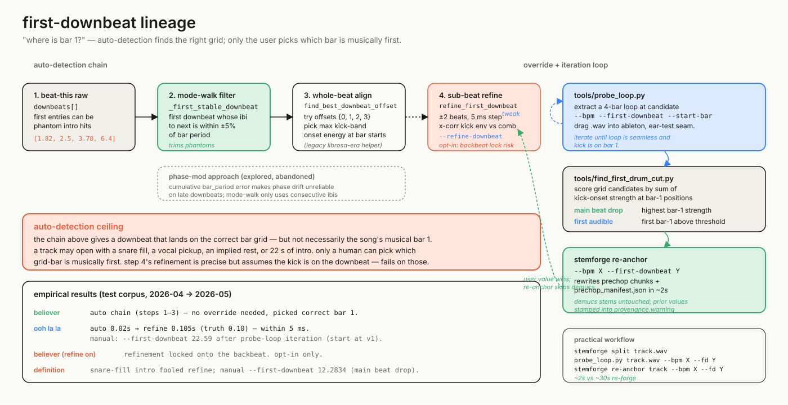

# first-downbeat lineage

## the auto-detection ceiling

Tempo and first-downbeat look like the same problem but they're not. BPM
is a property of the audio that any sufficiently good detector can
recover from interval statistics. "Where is bar 1?" is fundamentally a
musical-judgment question: a track may open with a snare fill, a vocal
pickup, an implied rest, two bars of pad, or 22 seconds of intro. The
auto-detection chain — `beat-this` raw downbeats → mode-walk filter →
`find_best_downbeat_offset` whole-beat alignment → opt-in
`refine_first_downbeat` sub-beat refinement — can find a downbeat that
sits on the *correct grid*, but it cannot pick which grid-bar is
musically the first. That's the ceiling. Phase-mod (compute "the grid"
from BPM and snap to mod) was explored and abandoned because cumulative
error from a slightly-wrong bar period (e.g. 0.38% off on Definition)
makes phase drift unreliable on late downbeats; the mode-walk
implementation in `_first_stable_downbeat` only uses *consecutive*
downbeat IBIs so drift never compounds. The output is "a real bar
boundary" you can trust to be on the grid, with no claim about whether
it's the song's musical bar 1.

## why probe_loop + re-anchor is the practical workflow

Because the ceiling is real, the workflow has to support fast iteration
on user-supplied values without re-running the slow part. That's what
`tools/probe_loop.py` and `stemforge re-anchor` are for. Probe extracts
a 4-bar loop at a candidate `--bpm` / `--first-downbeat` / `--start-bar`
combo into a standalone WAV; you drag it into Ableton, listen for
seamless looping with the kick on bar 1, adjust, repeat. Re-anchor
takes the values you arrived at and rewrites only the prechop chunks
and `prechop_manifest.json` in ~2 seconds — Demucs stems and per-beat
slices stay where they are, and `stems.json`'s
`tempo.warning` gets stamped with the prior BPM/first-downbeat and
the prior detector source so the full re-anchor history is recoverable.
`tools/find_first_drum_cut.py` exists for the case where you want
algorithmic guidance in picking among grid candidates: it sums
kick-onset strength across bar-1 positions for each candidate and
recommends two distinct picks — `MAIN BEAT DROP` (highest bar-1
strength, the moment the song commits) and `FIRST AUDIBLE` (first
bar-1 above threshold, the earliest legitimate start). Those are
different decisions, and the tool reports both rather than collapsing
them. Refinement (step 4) is opt-in for the same reason — it locked
onto Believer's backbeat in testing because Believer's bar 1 is
implied by the vocal, not played by the kick.

## what "bar 1 musically" actually means

The empirical results panel makes this concrete. Believer cleared the
auto chain end-to-end and needed no override; that's the easy case.
Ooh La La's auto-detection landed at 0.02 s, refinement closed it to
0.105 s (truth 0.10) within 5 ms — but the *user* still went with
22.59 s after probe-loop iteration because the song's musical "v1"
starts there, not at the first audible kick. Definition needed a
manual `--first-downbeat 12.2834` after diagnosing a snare-fill intro;
refinement would have locked onto the snare, not the downbeat. Those
three tracks span the practical range: the algorithm is right
(Believer), the algorithm is right and the user disagrees on what bar
1 means (Ooh La La), and the algorithm is wrong because the audio
violates the kick-on-1 assumption (Definition). Treating the override
as a first-class citizen in the manifest — `TempoProvenance.source =
"user-override"`, with the detector reading preserved in `warning` —
is what keeps each manual fix as a labeled example for whichever
future detector wants to push the ceiling up.
