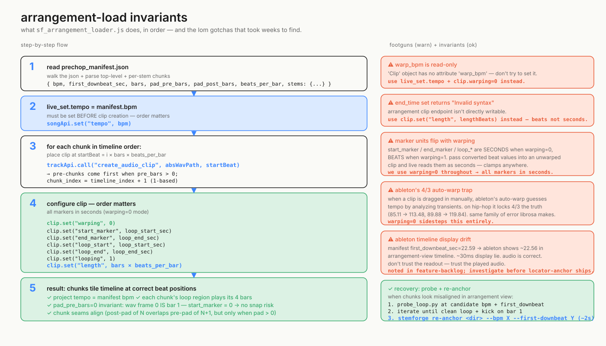

# Arrangement-load invariants

`sf_arrangement_loader.js` is the single most-debugged file in the M4L surface. It reads `prechop_manifest.json`, sets the project tempo, places audio clips at exact beat positions on tracks A/B/C/D, and configures each clip's playback markers. The flow is simple in the abstract — read manifest, place clips, set markers — but every step has a Live API gotcha that took empirical debugging to find. The five footguns on the right are not theoretical: each one is a real bug we hit and fixed.

The single most-important invariant is **`warping=0` on every clip**. With warping on, Ableton's auto-warp analyzes the audio and guesses a clip tempo, which on hip-hop tracks lands at 4/3 the truth (Ooh La La 85.11 → 113.48, Definition 89.88 → 119.84 — same family of error librosa was making before our reconciler fix). Setting `warping=0` makes Ableton play at the WAV's native sample rate against the project tempo, sidestepping the auto-warp entirely. This is paired with `start_marker` / `end_marker` / `loop_start` / `loop_end` set in **seconds** — these properties flip units between seconds and beats depending on warp state, and getting that wrong makes Live clamp markers anywhere they like. The recently-shipped `pad_pre_bars=0` default also collapses a class of issues by making WAV frame 0 == bar 1 of the chunk's musical content, so `start_marker = 0` and there's no Ableton snap-to-grid risk.

The order of operations in step 4 matters. Set `warping = 0` first (so subsequent markers are interpreted in seconds), then markers, then `looping = 1` last (some Live versions reset markers when looping is toggled), then `length` in beats (this property is in beats regardless of warp state and trims the clip's visible extent so post-pad audio doesn't render past the music body). `warp_bpm` is read-only — set `live_set.tempo` instead, before clip creation. `end_time` returns "Invalid syntax" on writes — use `length` instead.

When chunks look misaligned in arrangement view, the recovery procedure isn't "fix the loader" — it's `tools/probe_loop.py` to find the right `--bpm` and `--first-downbeat`, then `stemforge re-anchor` to rewrite the prechop output in-place in ~2 seconds without re-running Demucs. That iteration loop is what turned three broken tracks into three working ones during the closing session. See [03_first_downbeat_lineage.md](./03_first_downbeat_lineage.md) for the full override workflow.
