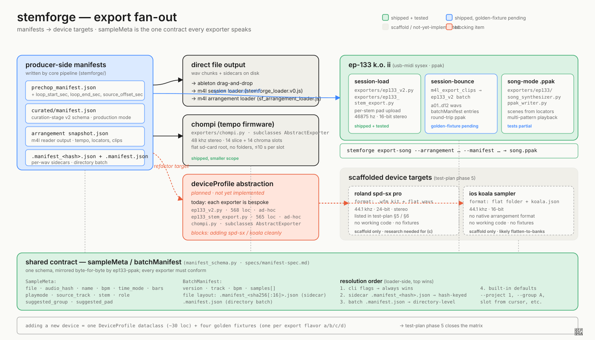

# Export targets fan-out

StemForge's export surface fans out from three central manifests (`prechop_manifest.json`, `curated/manifest.json`, arrangement `snapshot.json`) plus per-WAV `.manifest_<hash>.json` sidecars to multiple device targets. The manifest contract is the integration point — anything that can read `SampleMeta` / `BatchManifest` (the schema in [`stemforge/manifest_schema.py`](../../../stemforge/manifest_schema.py), mirrored byte-for-byte from `ep133-ppak/ep133/manifest.py`) can consume StemForge output.

**Resolution order** (highest precedence → lowest): CLI flags → per-file sidecar `.manifest_<hash>.json` → directory-level batch `.manifest.json` → built-in defaults. CLI always wins. The hash is `sha256(WAV_bytes)` lowercase hex, first 16 chars — rename-robust.

**Shipped device targets**:
- **EP-133 K.O. II**: three sub-paths — direct stem-pad upload (`stemforge.exporters.ep133_v2`), stem-aware pad assignment (`ep133_stem_export`), and song-mode `.ppak` with multi-pattern + scenes + song positions (`ep133.song_synthesizer` + `ep133.ppak_writer`). The wire format and protocol are delegated to the standalone `ep133-ppak` library.

**Scaffolded device targets** (placeholder fixtures only, no working code yet):
- **Roland SPD-SX Pro**: WFM kit format, 44.1 kHz / 24-bit / stereo. Listed in `docs/test-plan.md` Phase 5.
- **iOS Koala Sampler**: flat folder of WAVs + `koala.json`. Listed in Phase 5.

**Blocking**: there's no `AbstractExporter` / `DeviceProfile` abstraction yet — each exporter is bespoke. Adding SPD-SX or Koala without that refactor means duplicating ~80% of EP-133 plumbing. The test plan calls out the refactor; it's the gating item before scaffolds become real implementations.

For per-flavor coverage of the device matrix, see [07_device_matrix.svg](07_device_matrix.svg).
