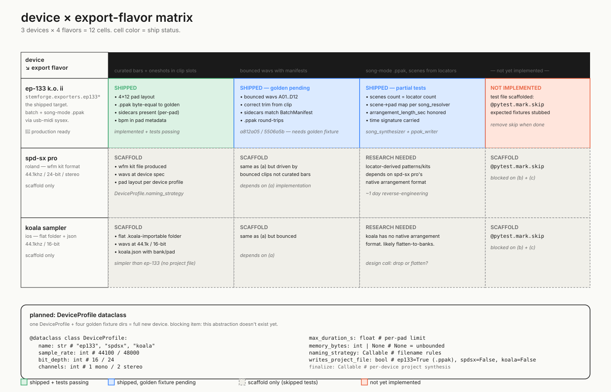

# Device × export-flavor matrix

A 3 × 4 grid: three target devices (EP-133 K.O. II, Roland SPD-SX Pro, iOS Koala Sampler) by four export flavors (a) session-view clip slot loading, (b) session bounce-export with rendered WAVs, (c) arrangement-with-locators song-mode export, (d) arrangement bounce-export. Each cell has a status (shipped + tests passing in `ok` green, shipped but golden-fixture-pending in `accent` blue, scaffold only in muted `panel`, not implemented in `warn` orange) and a brief list of what the cell's tests assert.

**Read order**: shipped column = EP-133 only. The other two devices have placeholder fixtures + scaffolded test files marked `@pytest.mark.skip`. The right column (arrangement bounce-export, flavor d) is universally not-yet-implemented across all three devices — same scaffolded-and-skipped pattern across the row. The blocking dependency under most cells is the `DeviceProfile` dataclass refactor at the bottom of the diagram: a single dataclass holding device specs (sample rate, bit depth, channels, max duration, memory limit, naming strategy, project-file flag, finalize callback) so adding a new device is one DeviceProfile + four golden-fixture directories. Currently `EP133Exporter` has all those specs inlined, which is why the SPD-SX and Koala scaffolds can't actually share infrastructure yet.

**Priority order** for filling in cells, per `docs/test-plan.md` Phase 5: (1) refactor `EP133Exporter` to use `DeviceProfile` (~half day), (2) generate golden fixture for EP-133 (b) bounce-export so its blue cell goes green, (3) implement (d) arrangement bounce-export across the row (the only "not implemented" cells), (4) research SPD-SX Pro WFM format and Koala flat-folder convention to fill in their scaffolds with real implementations. Adding a new device after the refactor should be ~1 day per device for format research + ~30 lines of `DeviceProfile` plus filling four fixture directories.

For per-device assertions and the manifest contract that all exporters share, see [06_export_targets.md](./06_export_targets.md). The `SampleMeta` / `BatchManifest` schema in [`stemforge/manifest_schema.py`](../../../stemforge/manifest_schema.py) is the integration point — every device target must produce or consume manifests conforming to it.
