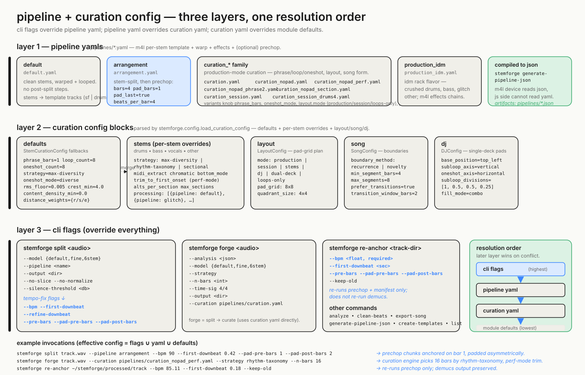

# Pipeline config layers + resolution order



StemForge has a three-layer config system. **Layer 1** is pipeline YAMLs in `pipelines/*.yaml` — `default`, `arrangement` (adds the prechop block), `curation_*` family, `production_idm`. Each YAML compiles to JSON via `stemforge generate-pipeline-json` because the M4L device's JS side can't read YAML. **Layer 2** is the curation config (`pipelines/curation.yaml`, parsed by `stemforge.config.load_curation_config`) — `defaults`, per-stem overrides under `stems`, plus `layout`, `song`, `dj` blocks. **Layer 3** is CLI flags on the `split`, `forge`, and `re-anchor` commands — these always override the YAML.

**Resolution order** (highest → lowest): CLI flags → pipeline YAML → curation YAML → module defaults. Concrete example: re-anchoring at corrected first_downbeat without rerunning Demucs:

```
stemforge re-anchor processed/ooh_la_la_feat_greg_nice_dj_premier_explicit \
    --bpm 85.11 --first-downbeat 22.59
```

The `--bpm` and `--first-downbeat` flags override whatever the pipeline YAML or auto-detector said. The reconciler still runs (for provenance) and its reading is stamped in `TempoProvenance.warning` so future detector improvements have labeled training examples.

The recently-shipped tempo-fix work added several new flags on `split` and `re-anchor`: `--bpm`, `--first-downbeat`, `--refine-downbeat`, `--pre-bars` (intro chunks at the same bar grid), `--pad-pre-bars` (default 0 — chunk WAV frame 0 is bar 1), `--pad-post-bars` (default 1 — drag-extend headroom). These compose with the pipeline YAML's `prechop` block to give per-track override without editing config files.
