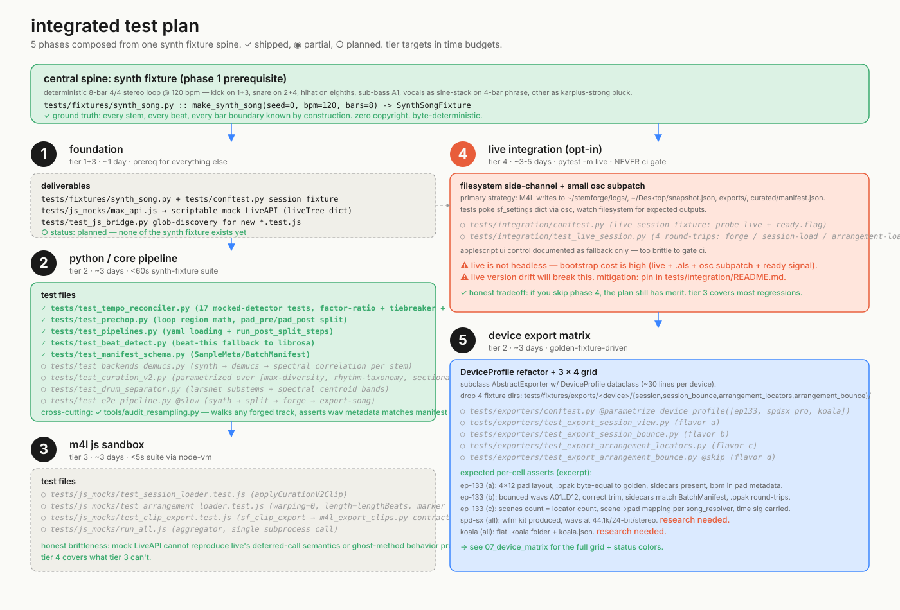

# Integrated test plan

The five-phase test strategy from [`docs/test-plan.md`](../../test-plan.md), drawn as a single picture. The synth fixture at the top is the central spine — a deterministic 8-bar 4/4 stereo loop at 120 BPM, generated by `make_synth_song()` from numpy with kick on 1+3, snare on 2+4, hihat on eighths, sub-bass A1, vocals as a sine-stack on a 4-bar phrase, and other as Karplus-Strong pluck. Every stem, every beat, every bar boundary is known by construction. Zero copyright. Byte-deterministic. Every other phase pulls from this fixture.

**Phase status (as of this writing)**: Phase 2 is partially shipped — `test_tempo_reconciler.py` (17 mocked-detector tests covering the factor-ratio heuristic, kick tiebreaker, and librosa fallback paths), `test_prechop.py`, `test_pipelines.py`, `test_beat_detect.py`, and `test_manifest_schema.py` all exist and pass. The synth fixture itself (Phase 1) doesn't exist yet — the existing tests use ad-hoc fixtures. Phase 3 (JS sandbox), Phase 4 (Live integration), and Phase 5 (device matrix) are all entirely planned. The cross-cutting `tools/audit_resampling.py` walks any forged track and asserts WAV metadata matches manifest claims (catches silent resamples) — that's already shipped and was used to validate Believer / Definition / Ooh La La during the closing session.

**The honest tradeoff with Phase 4 (Live integration)**: Live can't run headless. The recommended strategy is the filesystem side-channel — M4L writes status flags to `~/stemforge/logs/`, snapshot JSONs to `~/Desktop/`, and tests poke `sf_settings` (the device's coordination Dict) via OSC and watch for expected files to materialize. AppleScript UI control is documented as a fallback but not wired into pytest because it rots on every Live point release. Tier 4 is opt-in via `pytest -m live` and is **never a CI gate** — it's a developer pre-merge sanity check, not an automated test. If you skip Phase 4, the plan still has merit; Phase 3 covers most regressions, and Phase 4 mostly catches LOM-version drift.

**Adding a new device (Phase 5)** is supposed to be: subclass `AbstractExporter` with a `DeviceProfile` dataclass (~30 lines), drop four golden fixture directories (`session`, `session_bounce`, `arrangement_locators`, `arrangement_bounce`), and the parametrize tables auto-pick it up. The blocking item is that `AbstractExporter` and `DeviceProfile` don't exist yet — the current `EP133Exporter` has all device specs inlined. See [07_device_matrix.md](./07_device_matrix.md) for the per-cell status grid; the priority order is to refactor EP-133 to `DeviceProfile` first, then SPD-SX and Koala research, then implement flavor (d) arrangement bounce-export across the row.

For the source spec see [`docs/test-plan.md`](../../test-plan.md). For the device matrix detail see [07_device_matrix.md](./07_device_matrix.md). For the audit tool used in the closing session see [`tools/audit_resampling.py`](../../../tools/audit_resampling.py).
