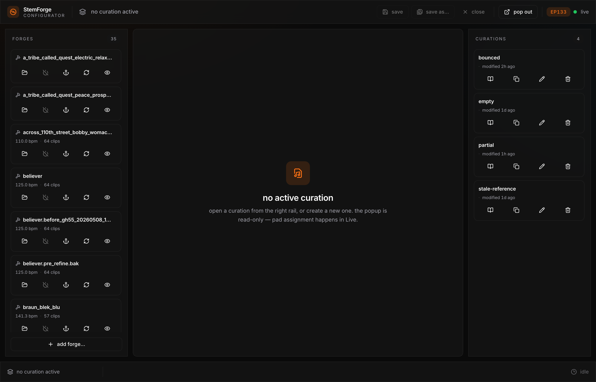
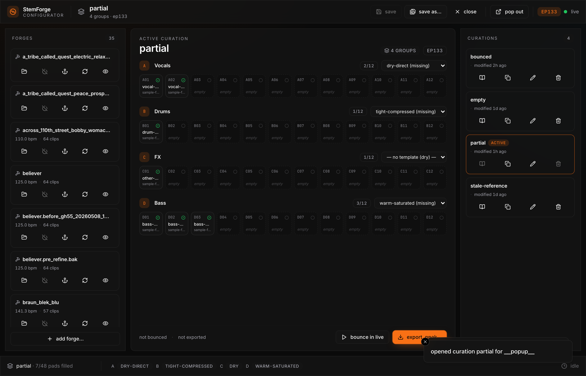
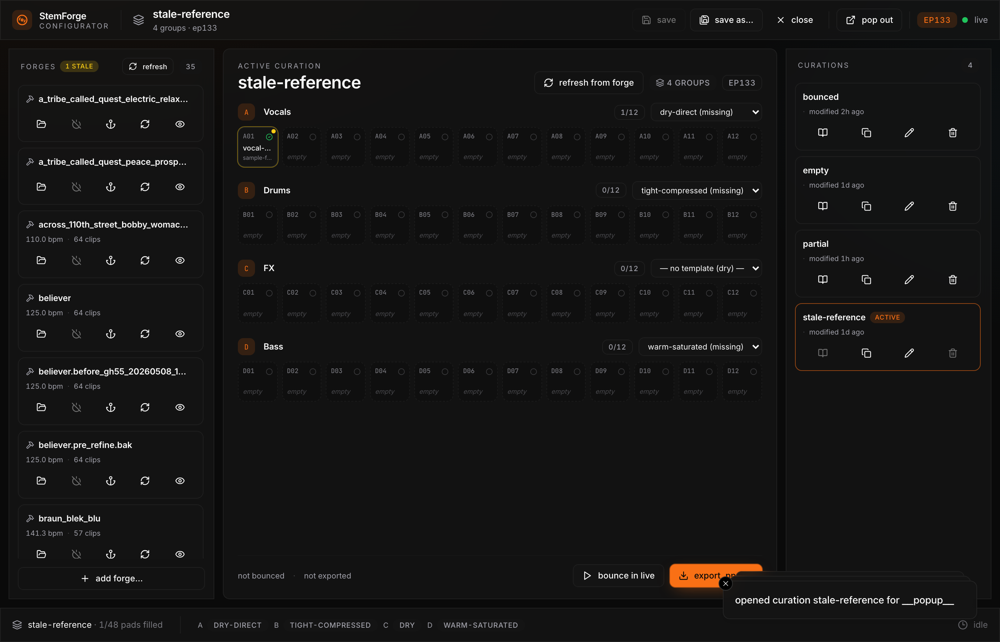
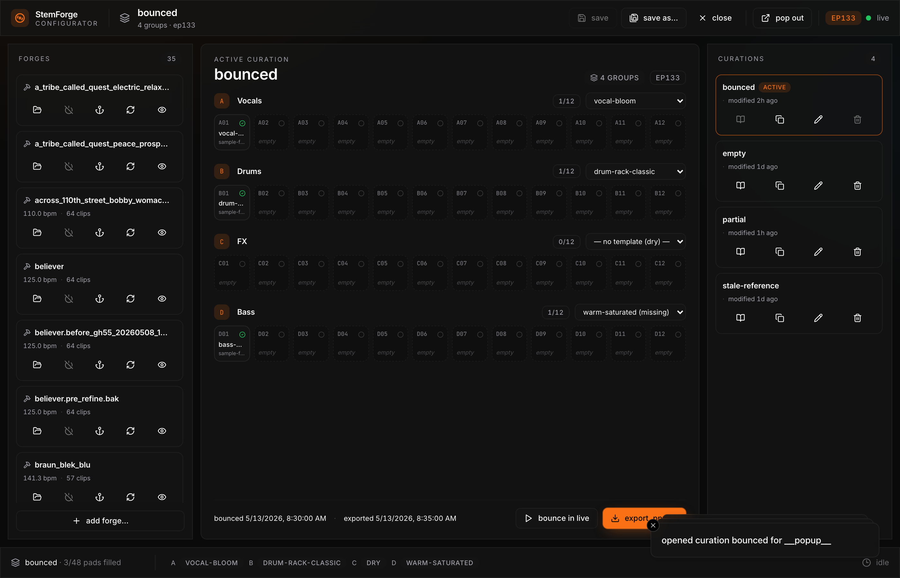
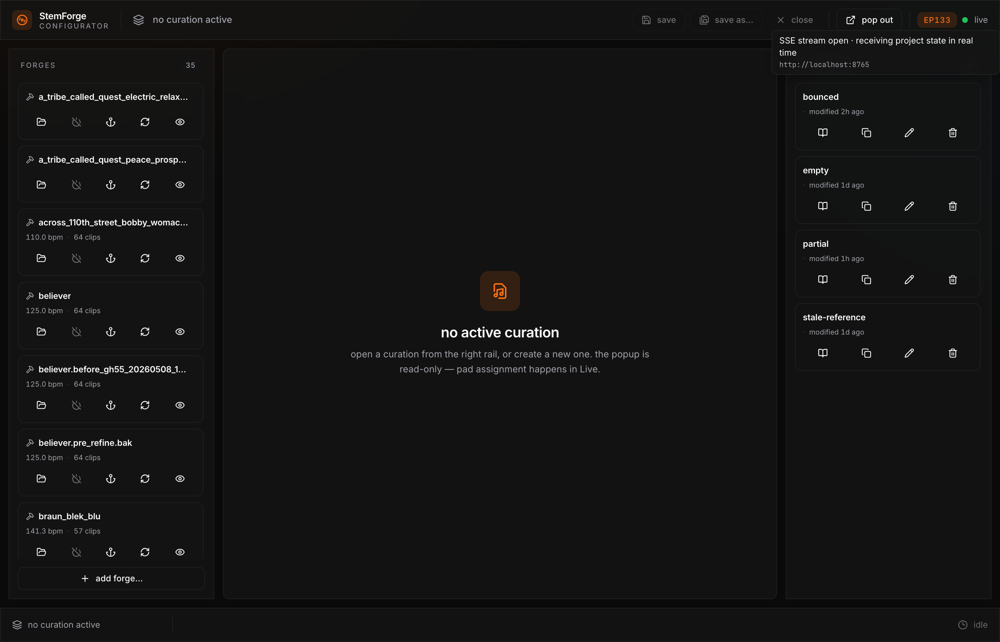

# StemForge Configurator v1 — User Acceptance Testing Guide

> **Audience**: you (Zak), about to drive the freshly-rebuilt Configurator
> end-to-end before declaring it production-ready.
>
> **Goal of UAT**: confirm the architecture works for your actual workflows —
> forge a song, curate pads onto a deck, bounce, export to a `.ppak`. Surface
> anything that doesn't match expectations.
>
> **Source of truth**: `specs/CONSOLIDATED_DESIGN.md` (the spec),
> `docs/configurator/EXECUTION_PLAN_v1.md` (what was built), and
> `docs/configurator/PRE_UAT_REVIEW.md` (what was fixed in the pre-UAT round).

---

## What's in scope for this UAT round

| Surface | Status | Notes |
|---|---|---|
| **Popup** (browser) | ✅ Ready | Three-panel layout, all endpoints wired, contract-tested |
| **Server** (FastAPI) | ✅ Ready | Curation CRUD + atomic writes + SSE broadcasts |
| **Device JS** (loader.js) | ✅ Ready | Picker, COMMIT walker, BOUNCE, template hot-apply all reachable via JS contract |
| **Device patcher** (`.amxd`) | ⚠️ Built but not yet installed in your Live | New UI lift in PR #118 — needs Max Package re-install before on-device UAT |
| **Live integration** | ⏸ Deferred | Phase 5 ships the AppleScript runner + 10 smoke tests; only `empty-staging.als` fixture is hand-crafted. Real Live work is post-UAT |

**Bottom line for this UAT**: drive everything through the popup against the
running server. The device side is reachable via the popup's send-to-device
buttons (which UDP into the loader's JS contract) — you'll see status text
on-device confirming receipt, but the on-device visual buttons match the new
spec §3.1 layout only after a fresh Max Package install.

---

## Setup

### 1. Start the server

```bash
cd /Users/zak/zacharysbrown/stemforge
uv run uvicorn stemforge.configurator.server:create_app --factory --port 8765 --host 127.0.0.1
```

The server discovers `~/stemforge/` and writes `~/stemforge/.configurator_port`
with the actual port.

### 2. Build + serve the popup

```bash
cd web/configurator
npm run build:deploy          # builds + rsyncs to stemforge/configurator/static/
```

The popup is served at the same origin as the API. Open
**[http://localhost:8765/](http://localhost:8765/)** in Chrome.

### 3. Seed fixtures (one time)

```bash
mkdir -p ~/stemforge/{curations,processed,templates,bounced,exports}
cp -r tests/fixtures/forges/sample-forge ~/stemforge/processed/sample-forge
cp -r tests/fixtures/forges/breaks-n-beats-deck ~/stemforge/processed/breaks-n-beats-deck
cp tests/fixtures/curations/*.yaml ~/stemforge/curations/
cp tests/fixtures/templates/*.adg ~/stemforge/templates/
cp tests/fixtures/templates/*.description ~/stemforge/templates/
```

You probably already have 30+ real forges in `~/stemforge/processed/`. That's
fine — they'll all show up in the left rail.

### 4. (Optional) Install the new `.amxd` for on-device UAT

```bash
# Copy the freshly-rebuilt device into your Max Package install.
cp v0/build/StemForge.amxd "$HOME/Documents/Max 8/Library/StemForge/Devices/"
# Open Live, drag the device onto a track — the new spec §3.1 layout should appear.
```

The new device has: `[Pick source…]` button, a status line, a primary
**FORGE / LOAD FORGE / LOAD CURATION** button whose label is driven by the
sniffer, a **COMMIT · BOUNCE · EXPORT** row, and an **Open Editor** footer.

---

## The three-panel layout



| Panel | What it shows | What you can do |
|---|---|---|
| **Left — FORGES** | All forges in `~/stemforge/processed/` with bpm + clip count + per-row action icons | Load · Unload · Re-anchor · Re-curate · Reveal in Finder · **+ add forge…** |
| **Center — ACTIVE CURATION** | Read-only grid view of the selected curation: 4 (or N) groups × 12 pads | Switch group template via the dropdown · Bounce or Export · See per-pad clip metadata |
| **Right — CURATIONS** | All `.yaml` curations in `~/stemforge/curations/` | **Click a row to open it** · Open as active · Duplicate · Rename · Delete |
| **Top bar** | Active curation name + target chip + Save / Save as / Close / Pop out + connection dot | Save is intentionally disabled (curation files are written by device COMMIT) |
| **Status bar** | Live curation summary + per-group template chips + progress | Read-only |

---

## Smoke test (5 min — do this first)

| Step | Action | Expected | Pass? |
|---|---|---|---|
| 1 | Open `http://localhost:8765/` | Three-panel layout renders; left rail shows all forges; right rail shows 4 fixture curations | ☐ |
| 2 | Hover the green dot in the top right | Tooltip: "SSE stream open · receiving project state in real time" with the server URL | ☐ |
| 3 | Click the `partial` tile in the right rail | Center panel fills with 4 groups (Vocals/Drums/FX/Bass), templates labeled (`dry-direct`, `tight-compressed`, `— no template (dry)`, `warm-saturated`), 7 pads showing filled slots | ☐ |
| 4 | Click the `stale-reference` tile | Left rail gains a **STALE** badge; `[refresh from forge]` button appears in the active-curation header | ☐ |
| 5 | Click the `bounced` tile | StatusBar at the bottom shows `bounced 5/13/2026, 8:30:00 AM · exported 5/13/2026, 8:30:00 AM` | ☐ |
| 6 | Click the Save button in the top bar | Nothing happens; tooltip explains why (curation files are written by the device's COMMIT action) | ☐ |
| 7 | Click "Pop out" in the top bar | New OS-native window opens with the same UI (popup mode) | ☐ |
| 8 | Click "× close" in the top bar | Active curation clears; popup returns to "no active curation" empty state | ☐ |

If all 8 pass, the popup baseline is solid. Continue.

---

## Visual walkthrough

### Loaded curation — `partial` (7 pads filled across 4 groups)



What to verify:
- The **active row** in the right rail is highlighted in orange ("ACTIVE" badge).
- The **target chip** at the top reads `4 groups · ep133`.
- Each group header shows the template name (or `— no template (dry)` for FX).
- Each filled pad (A·01, A·02, B·01, C·01, D·01, D·02, D·03) has a tiny audio glyph.
- The **toast** at the bottom right confirms: `opened curation partial for __popup__` (the headless-popup sentinel; see §6 for what this means).

### Stale references — `stale-reference`



What to verify:
- The **FORGES** label in the left rail shows a `1 STALE` badge with a `↻ refresh` button.
- A `[refresh from forge]` button appears in the active-curation header.
- The stale pads (A·01 in this fixture) render with a subtle warning indicator.
- Reason: this fixture's `referenced_forges[].manifest_hash` is all-zeros; the server detects the mismatch against the current forge's real hash.

### Bounced curation — `bounced`



What to verify:
- StatusBar shows both `bounced <timestamp>` AND `exported <timestamp>` because this fixture has both `last_bounce` and `last_export` populated.
- All four templates are populated: `vocal-bloom`, `drum-rack-classic`, `— no template (dry)`, `warm-saturated (missing)` — the `(missing)` annotation is the server reporting that `warm-saturated.adg` isn't installed; this is correct behavior.

### Connection status tooltip



Hover the green "live" dot at the top-right to see the SSE stream status + server URL.

---

## Verb-by-verb tests

These are the five canonical configurator verbs per spec §3.3. Walk each one.

### 1. FORGE — turn an audio file into a curated set of clips

UAT path (popup-driven):
1. Click **+ add forge…** at the bottom of the left rail.
2. Native macOS `choose file` dialog opens → pick a WAV (e.g.
   `~/Music/<some-song>.wav`).
3. Server detects file kind via the sniffer; forge processing runs in the
   background; SSE `progress` events update the UI.
4. New forge entry appears in the left rail when complete.

**What to verify**:
- ☐ Click the **+ add forge…** button — file picker opens.
- ☐ Cancel the dialog — no error toast; popup state unchanged.
- ☐ Pick a WAV — progress bar appears; new forge appears with bpm + clip count.

> **Known scope limit**: this UAT round's pick-manifest is purely server-side
> osascript. If you want to do this end-to-end on a real Live device, you need
> the new `.amxd` installed (§Setup step 4) so the device's `[Pick source…]`
> button is reachable.

### 2. LOAD — fetch a curation from disk into Live

UAT path:
1. Pick a curation from the right rail (e.g. `partial`) — click the tile.
2. Server marks it active in `~/stemforge/.stemforge_state.json` under the
   `__popup__` sentinel key.
3. The center panel populates.
4. **On real device**: the loader's `loadCuration()` JS function walks the LOM
   and recreates `STG-A` … `STG-N` tracks with the deck's clips dropped into
   slots. This requires the new `.amxd` installed AND Live running with the
   right `.als`. For this UAT round, verify the popup behavior only.

**Verify**:
- ☐ Clicking a curation tile populates the center panel.
- ☐ Clicking a different curation swaps the center panel content.
- ☐ Clicking the active curation tile is a no-op (already active).
- ☐ "× close" clears the active curation; popup returns to empty state.

### 3. COMMIT — snapshot the device's current staging into a curation file

UAT path:
- Phase 2 keystone: the device's `commit()` JS function walks `STG-A`…`STG-N`,
  builds a snapshot, POSTs to `/curations/{name}/commit`, server reverse-looks-
  up each audio path against the forges, writes atomically, broadcasts SSE.
- L3 + integration tests already verify this end-to-end **without Live**
  (see `tests/test_commit_keystone.py`).

**For UAT**: you can verify the server-side path with curl:
```bash
curl -s http://127.0.0.1:8765/curations/partial/commit \
  -H "Content-Type: application/json" \
  -d '{"als_path": "__popup__", "groups": {}}' | python3 -m json.tool
```
Should return the unchanged curation with a fresh `modified_at`.

The real on-device path requires the new `.amxd` + Live.

### 4. BOUNCE — render each pad to a WAV under `~/stemforge/bounced/`

UAT path:
1. Open a curation (e.g. `partial`).
2. Click the **bounce in Live** button at the bottom of the center panel.
3. Server constructs a bounce spec, fires UDP to the device (`messnamed
   sf-bounce-start`).
4. **Without Live**: server returns the constructed spec immediately. Popup
   displays the spec inline (P1-8 fix from Lane F) — N pads, target paths,
   per-group templates baked in.

**Verify in popup-only mode**:
- ☐ Click bounce — spec appears in a small inline panel showing
  `Bouncing N pads to ~/stemforge/bounced/partial/` + collapsible per-pad
  list.
- ☐ For a curation with 0 pads (e.g. `empty`), bounce surfaces an error
  toast / disabled state.

### 5. EXPORT — produce a `.ppak` file for the EP-133

UAT path:
1. Open a curation.
2. Click **export** in the center panel header.
3. Native `choose save location` dialog opens (osascript).
4. Server runs `stemforge export <curation-name> --target ep133 --out
   <path>` as a subprocess; stdout/stderr surface in a toast.

**Verify**:
- ☐ Click export — save-dialog opens.
- ☐ Cancel — no error toast.
- ☐ Pick a path → server returns 200; `last_export` field updates in the
  curation file; the popup re-renders with the new export timestamp.
- ☐ Bad target_format (you'd have to manually curl this) → 400.

### 6. RE-ANCHOR — re-run the auto-curation step with new BPM/downbeat

UAT path:
1. In the left rail, click the anchor icon (⚓) on a forge row.
2. A small dialog asks for `first_downbeat_seconds` + `source_bpm` (or it
   may pop a curl-style prompt — UAT this).
3. Server runs `stemforge re-anchor <slug> --first-downbeat X --bpm Y` as a
   subprocess.
4. New `auto_curation_manifest.json` written with a fresh `manifest_hash`.
5. Any curations referencing this forge with the old hash now show stale
   badges (see §Stale handling).

**Verify**:
- ☐ Re-anchor a fixture forge → new manifest_hash on the next `GET /forges`.
- ☐ A curation that referenced the OLD hash now shows stale badges in the
  popup.
- ☐ Click `refresh from forge` on the stale curation — pads re-resolve to
  the new hash; stale badges clear.

---

## Edge cases worth poking at

| Scenario | Where it lives | Expected behavior |
|---|---|---|
| **Empty curation** (`empty.yaml`) | right rail | Center panel shows 4 group headers + 48 empty pad slots; no bounce/export buttons enabled |
| **Stale references** | `stale-reference.yaml` | Stale badge on forge + per-pad indicator; `refresh from forge` button visible |
| **Missing template** | `bounced.yaml` Bass group references `warm-saturated.adg` | Annotation: `warm-saturated (missing)` — graceful, no crash |
| **Server disconnect** | kill server while popup open | Top-right dot turns yellow / red; tooltip explains; popup retries via SSE auto-reconnect |
| **No active curation** | cold start, or after Close | Center panel: "no active curation — open one from the right rail, or create a new one" |
| **Re-anchor mid-bounce** | rare race | Server's atomic-write + flock should prevent corruption; if it doesn't, that's a bug report |

---

## What to do if something breaks

For each issue:

1. **Capture the popup console** — `Cmd-Opt-J` in Chrome → screenshot or copy
   any red errors.
2. **Capture the server log** — the uvicorn output in your shell.
3. **Capture the SSE event stream** if relevant:
   ```bash
   curl -sN http://127.0.0.1:8765/state/stream
   ```
4. **Note the curation YAML state** — the server writes everything to
   `~/stemforge/curations/<name>.yaml`, so a `git diff`-style copy of that
   file pre/post-action is gold.
5. **Note the `.stemforge_state.json`** — under `~/stemforge/`.
6. **Open a GitHub issue** with all of the above.

---

## Known scope limits for this UAT round

These were intentionally deferred from pre-UAT remediation:

1. **`.amxd` not yet installed in your Live** — see §Setup step 4 to install
   the freshly-rebuilt device with the spec §3.1 picker UI. Without this,
   on-device UAT will see the *old* `sf_preset_menu` / `sf_source_menu` umenus
   even though the JS contract is correct.
2. **Real Live integration tests** — Phase 5 ships the AppleScript runner +
   the `empty-staging.als` hand-crafted skeleton, but the other 9 smoke tests
   need fixture `.als` files captured from your real Live. Procedure documented
   in `tests/fixtures/als/README.md`.
3. **`_getAlsPath()` LOM verb chain** — the device tries 3 fallback verbs; in
   the wild they may all return empty. If the popup never shows the bootstrap
   curation when you open a `.als` in Live, this is why. Test verifies the
   chain semantics but the actual verbs need a real Live to validate.
4. **`useProjectState` reconnect token pattern** — uses a `useRef.current` in
   the React deps array with an `eslint-disable`. Works but not idiomatic.
   Post-UAT polish.
5. **ForgeList virtualization** — 35 forges render fine; if your list grows to
   200+ it might stutter. No virtualization in deps yet; will add `react-window`
   if needed.
6. **"Create new curation" affordance** — currently curations are created by
   the device's COMMIT action (the keystone path). The popup has no
   "new empty curation" button; this is a deliberate Phase 6 scope decision
   matching spec §3.3 ("device writes, popup reads").

---

## Reference: where things live

```
~/stemforge/
├── curations/          ← .yaml curation files (right rail)
├── processed/          ← per-forge directories (left rail)
│   └── <slug>/
│       ├── auto_curation_manifest.json
│       ├── arrangement_manifest.json
│       ├── stems/        ← raw split stems
│       └── curated_audio/← clipped bars
├── templates/          ← .adg files for per-group rack selector
├── bounced/            ← per-curation rendered WAVs
├── exports/            ← .ppak outputs
└── .stemforge_state.json  ← active-curation map (per .als host + __popup__ sentinel)
```

Source repo structure:
- **Server**: `stemforge/configurator/`
- **Popup**: `web/configurator/src/`
- **Device JS**: `v0/src/m4l-js/stemforge_loader.v0.js` (+ mirror in
  `v0/src/m4l-package/StemForge/javascript/`)
- **Device patcher**: `v0/src/maxpat-builder/builder.py`
- **Tests**:
  - Python: `stemforge/configurator/schemas/test_*.py`, `tests/test_configurator_*.py`,
    `tests/test_commit_keystone.py`, `tests/test_popup_contract.py`,
    `tests/test_configurator_sse_shape.py`
  - JS: `v0/src/m4l-js/stemforge_loader.v0.test.js`,
    `tools/test-harness/max-stub.test.js`
  - Popup: `web/configurator/src/**/*.test.tsx`
- **Live smoke**: `tools/test-harness/live-runner.sh`,
  `tests/fixtures/als/` (mostly placeholders; capture procedure in the
  fixture README)

---

## When you're done

If everything works:
- Note it in your UAT log + share back what you tried.
- Optional: capture better `.als` fixtures to flesh out Phase 5's smoke suite.

If something broke:
- Open issues with reproduction steps + the diagnostic artifacts from
  "What to do if something breaks" above.
- I can spawn fixer agents on each, same pattern as the pre-UAT remediation
  lanes.

Have fun.
